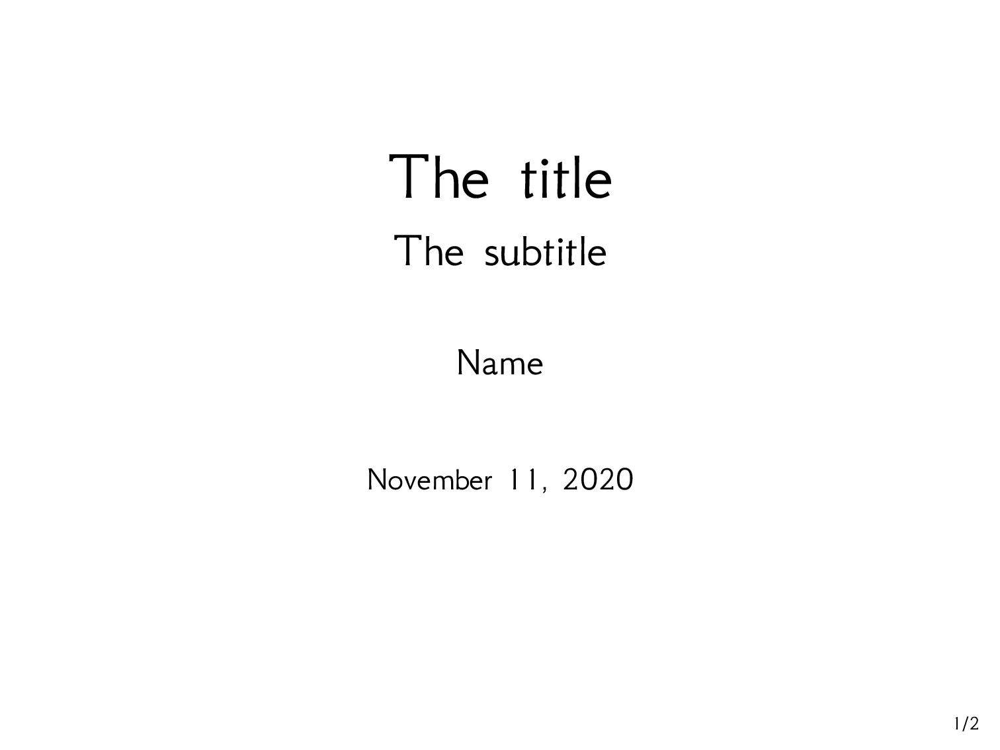
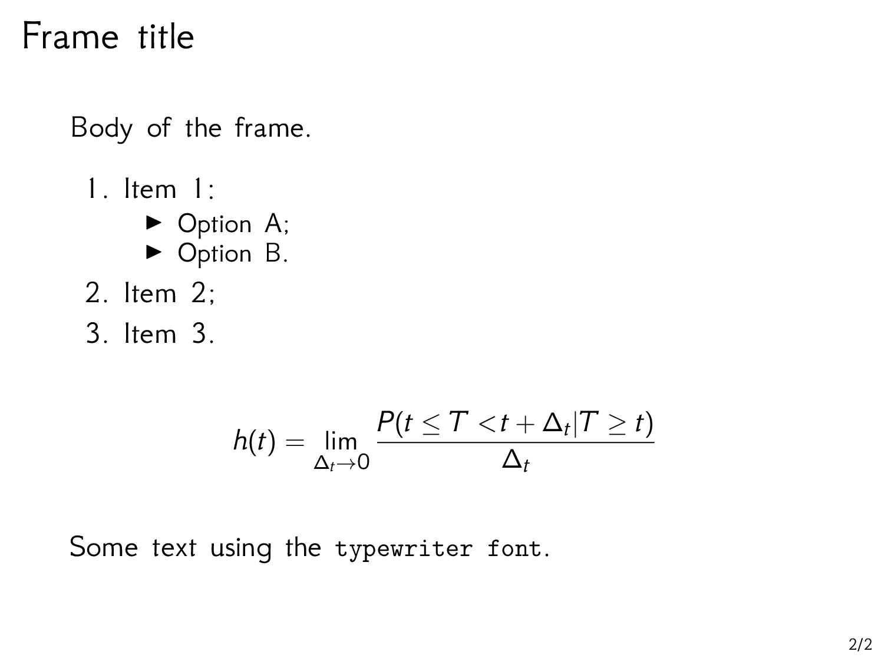

# `null` - A beamer theme

A streamlined beamer template based on the default theme.

This theme is completely black and white, and it uses [GFS Neohellenic](https://tug.org/FontCatalogue/gfsneohellenic/) as font of choice.

## Using the theme

You can use this theme by including

```latex
\usebeamertheme{null}
```

in the header of your presentation.

## Demos

See [default.pdf](./default.pdf) for the default look of the theme:

[](./default.pdf)

[](./default.pdf)
